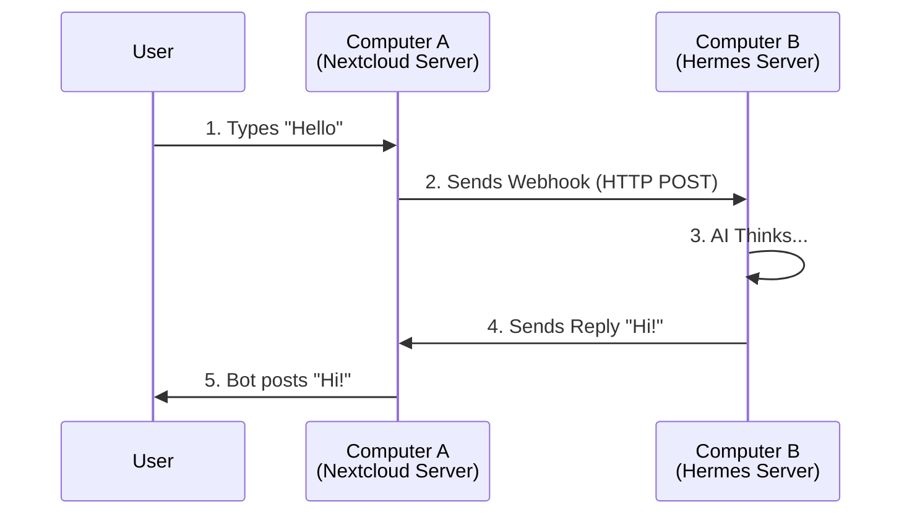

# Nextcloud Talk Bot Plugin for Hermes Agent

Connect your **Nextcloud Talk** bot to **Hermes Agent**.
This allows your bot to chat with AI.

---

## 🧠 Theory: How it Works

Imagine two computers talking to each other:

1.  **Computer A (Nextcloud)**: Has the chat rooms and the Bot.
2.  **Computer B (Hermes)**: Has the AI Brain.

### The Communication Flow



**Security**: To prevent hackers from impersonating the bot, they use a **"Secret Password"** (HMAC). Both computers must agree on this password.

---

## 🚀 Quick Start Guide

### Prerequisites
- A running **Nextcloud** server.
- A running **Hermes Agent** server.
- Access to both servers (via SSH/Terminal).

### Step 1: On Nextcloud Server (Generate Credentials)

You need to create a bot and get a **Secret** and a **Webhook URL**.

1.  Log in to your Nextcloud server terminal.
2.  Run the following command to install the bot:

    ```bash
    php occ talk:bot:install "Hermes Bot" "MY_SUPER_SECRET" "http://HERMES_SERVER_IP:8745/nextcloud-talk/callback"
    ```

    > **⚠️ Important Notes:**
    > - Replace `MY_SUPER_SECRET` with a strong password (you will need this later).
    > - Replace `HERMES_SERVER_IP` with the **IP address** or **Domain** of your Hermes server (e.g., `192.168.1.100` or `hermes.example.com`).
    > - Ensure port `8745` is open on the Hermes server firewall.

3.  **Copy the Secret** (`MY_SUPER_SECRET`). You will need it in Step 2.

### Step 2: On Hermes Server (Configure Plugin)

Now tell Hermes how to talk to Nextcloud.

1.  Open your Hermes configuration file (usually located at `~/.hermes/profiles/YOUR_PROFILE/config.yaml`).
    *   *Example:* `~/.hermes/profiles/trinity/config.yaml`
2.  Add or update the `nextcloud_talk` section:

    ```yaml
    gateway:
      platforms:
        nextcloud_talk:
          enabled: true
          extra:
            # Your Nextcloud URL (must start with http:// or https://)
            base_url: "https://cloud.your-domain.com"
            
            # The Secret you copied from Step 1
            bot_secret: "MY_SUPER_SECRET"
            
            # Port must match the port in Step 1 (default 8745)
            port: 8745
            
            # Optional: Path (keep default unless you changed it)
            path: "/nextcloud-talk/callback"
    ```

3.  Save the file.
4.  Restart Hermes Agent to apply changes.

---

## ⚙️ Configuration Reference

| Setting | Description | Example |
|---------|-------------|---------|
| `base_url` | Your Nextcloud server URL. | `"https://cloud.example.com"` |
| `bot_secret` | The secret password generated in Step 1. | `"my-secret-password"` |
| `port` | Port Hermes listens on. Must match Step 1. | `8745` |
| `path` | URL path for the webhook. | `"/nextcloud-talk/callback"` |

---

## 🛠️ Troubleshooting

### ❌ "403 Forbidden" or "Invalid signature"
- **Cause**: The `bot_secret` in Hermes does not match the one in Nextcloud.
- **Fix**: Check your `config.yaml` and ensure the secret is exactly the same (case-sensitive).

### ❌ "Connection Refused"
- **Cause**: Nextcloud cannot reach Hermes.
- **Fix**:
    1. Check if the IP/Domain in Step 1 is correct.
    2. Check if the Hermes server firewall (UFW/iptables) allows port `8745`.
    3. Run `curl http://localhost:8745/nextcloud-talk/callback` on the Hermes server to test.

### ❌ "400 Bad Request"
- **Cause**: Missing headers or invalid JSON.
- **Fix**: Usually happens if the URL path is wrong. Ensure `path` in config matches the one used in `occ talk:bot:install`.

---

## 📂 Project Structure

```
nextcloud_talk/
├── plugin.yaml    # Plugin metadata
├── __init__.py    # Plugin loader
└── adapter.py     # Core logic (Webhook handler, API client)
```

---

## 📜 License

MIT