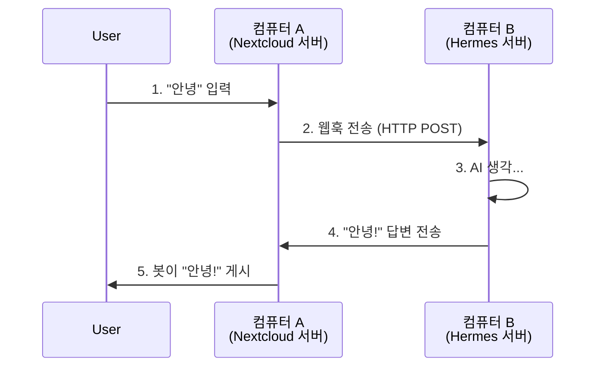

# Hermes Agent 용 Nextcloud Talk Bot 플러그인

**Nextcloud Talk** 봇을 **Hermes Agent** 에 연결하세요.
봇이 AI 와 대화하도록 연결하는 플러그인입니다.

---

## 🧠 이론: 어떻게 작동하나요?

두 컴퓨터가 서로 대화한다고 상상해보세요:

1.  **컴퓨터 A (Nextcloud)**: 채팅방과 봇이 있는 곳
2.  **컴퓨터 B (Hermes)**: AI 두뇌가 있는 곳

### 통신 흐름



**보안**: 해커가 봇을 사칭하지 못하도록 **"비밀 비밀번호"(HMAC)** 를 사용합니다. 두 컴퓨터가 이 비밀번호를 공유해야 합니다.

---

## 🚀 빠른 시작 가이드

### 준비물
- 실행 중인 **Nextcloud** 서버
- 실행 중인 **Hermes Agent** 서버
- 두 서버 모두 접근 가능 (SSH/터미널)

### 1 단계: Nextcloud 서버에서 (자격 증명 생성)

봇을 만들고 **Secret(비밀번호)** 과 **Webhook URL** 을 받아야 합니다.

1.  Nextcloud 서버 터미널에 로그인하세요.
2.  다음 명령어를 실행하여 봇을 설치하세요:

    ```bash
    php occ talk:bot:install "Hermes Bot" "MY_SUPER_SECRET" "http://HERMES_SERVER_IP:8745/nextcloud-talk/callback"
    ```

    > **⚠️ 중요:**
    > - `MY_SUPER_SECRET` 은 강력한 비밀번호로 변경하세요 (나중에 필요합니다).
    > - `HERMES_SERVER_IP` 는 Hermes 서버의 **IP 주소** 또는 **도메인**으로 변경하세요 (예: `192.168.1.100` 또는 `hermes.example.com`).
    > - Hermes 서버에서 포트 `8745` 가 열려 있는지 확인하세요.

3.  **Secret 을 복사하세요**. 2 단계에서 필요합니다.

### 2 단계: Hermes 서버에서 (플러그인 설정)

Hermes 가 Nextcloud 와 대화하는 방법을 알려주세요.

1.  Hermes 설정 파일을 엽니다 (일반적으로 `~/.hermes/profiles/YOUR_PROFILE/config.yaml`).
    *   *예:* `~/.hermes/profiles/trinity/config.yaml`
2.  `nextcloud_talk` 섹션을 추가하거나 업데이트하세요:

    ```yaml
    gateway:
      platforms:
        nextcloud_talk:
          enabled: true
          extra:
            # Nextcloud URL (http:// 또는 https:// 로 시작해야 함)
            base_url: "https://cloud.your-domain.com"
            
            # 1 단계에서 복사한 Secret
            bot_secret: "MY_SUPER_SECRET"
            
            # 포트는 1 단계와 일치해야 함 (기본 8745)
            port: 8745
            
            # 옵션: 경로 (변경하지 않았다면 기본값 유지)
            path: "/nextcloud-talk/callback"
    ```

3.  파일을 저장하세요.
4.  변경 사항을 적용하기 위해 Hermes Agent 를 재시작하세요.

---

## ⚙️ 설정 참고

| 설정 | 설명 | 예시 |
|------|------|------|
| `base_url` | Nextcloud 서버 URL | `"https://cloud.example.com"` |
| `bot_secret` | 1 단계에서 생성한 비밀번호 | `"my-secret-password"` |
| `port` | Hermes 가 듣는 포트. 1 단계와 일치해야 함. | `8745` |
| `path` | 웹훅 URL 경로 | `"/nextcloud-talk/callback"` |

---

## 🛠️ 문제 해결

### ❌ "403 Forbidden" 또는 "Invalid signature"
- **원인**: Hermes 의 `bot_secret` 가 Nextcloud 의 Secret 과 다름
- **해결**: `config.yaml` 을 확인하고 비밀번호가 정확히 일치하는지 확인 (대소문자 구분)

### ❌ "Connection Refused"
- **원인**: Nextcloud 가 Hermes 에 도달하지 못함
- **해결**:
    1. 1 단계의 IP/도메인이 올바른지 확인
    2. Hermes 서버 방화벽 (UFW/iptables) 이 포트 `8745` 를 허용하는지 확인
    3. Hermes 서버에서 `curl http://localhost:8745/nextcloud-talk/callback` 테스트

### ❌ "400 Bad Request"
- **원인**: 헤더 누락 또는 잘못된 JSON
- **해결**: 일반적으로 경로가 잘못되었을 때 발생. 설정의 `path` 가 `occ talk:bot:install` 에서 사용한 것과 일치하는지 확인

---

## 📂 프로젝트 구조

```
nextcloud_talk/
├── plugin.yaml    # 플러그인 정보
├── __init__.py    # 플러그인 로더
└── adapter.py     # 핵심 로직 (웹훅 핸들러, API 클라이언트)
```

---

## 📜 라이선스

MIT